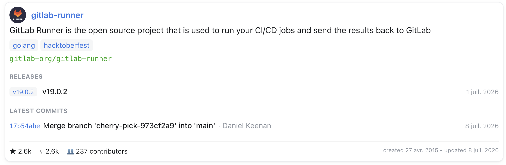

# @ebuildy/docusaurus-plugin-gitlab

[](https://scorecard.dev/viewer/?uri=github.com/ebuildy/docusaurus-plugin-gitlab)


Embed **GitLab** resources — project info, README, releases, issues, and any
file or code snippet — directly in your **Docusaurus 3** documentation using MDX
components.



All data is fetched **at build time** and baked into your static site. No API
tokens or network calls ever reach the browser, and pages stay fast.

- ✅ Works with **gitlab.com** and self-hosted GitLab (configurable host)
- ✅ Authenticated (private projects) or public, via a build-time token
- ✅ Five ready-to-use JSX components
- ✅ README images **and badges are downloaded and localized** (offline-safe, frozen at build time)
- ✅ On-disk caching, theme-aware (Infima) styling, graceful error fallbacks

> Requires Docusaurus **3.x** and Node **22.13+ or 24**.

## Installation

```bash
npm install @ebuildy/docusaurus-plugin-gitlab
```

> **ESM-only.** This package ships as ES modules (all of its remark/rehype
> dependencies are ESM). Load it from an ESM config — `docusaurus.config.ts` or
> `docusaurus.config.mjs` (the examples below use `import`). CommonJS configs
> work too on the supported Node versions (22.13+), since Node can `require()`
> ES modules natively.

## Setup

Two one-time steps in your Docusaurus site.

### 1. Register the remark plugin

In `docusaurus.config.js` (or `.ts`), add the remark plugin to your docs/blog
preset:

```js
import { remarkGitlab } from "@ebuildy/docusaurus-plugin-gitlab";

export default {
  presets: [
    [
      "classic",
      {
        docs: {
          remarkPlugins: [
            [
              remarkGitlab,
              {
                host: "https://gitlab.com",
                token: process.env.GITLAB_TOKEN, // optional for public projects
              },
            ],
          ],
        },
      },
    ],
  ],
};
```

### 2. Register the components

Make the components available in every `.mdx` page by swizzling `MDXComponents`.
Create `src/theme/MDXComponents.js`:

```js
import MDXComponents from "@theme-original/MDXComponents";
import * as Gitlab from "@ebuildy/docusaurus-plugin-gitlab/components";

export default { ...MDXComponents, ...Gitlab };
```

Now write the components in any `.mdx` page — no per-page imports needed.

## Components

The `project` prop accepts either a numeric ID (`project={12345}`) or the full
namespace path (`project="group/subgroup/repo"`).

### `<GitlabProjectInfo>`

A card with name, description, topics, stars/forks, and last activity. It can
also embed compact **releases**, **commits**, and **issues** sections — each is
opt-in and only fetched when its count prop is a positive number.

```mdx
<GitlabProjectInfo project="group/repo" />
<GitlabProjectInfo project="group/repo" showStats={false} />

<GitlabProjectInfo project="group/app" releases={3} commits={5} issues={5} />

<GitlabProjectInfo project="group/app" releases={3} releasesLayout="cards" link="https://example.com/app" />
```

| Prop | Type | Default | Description |
|---|---|---|---|
| `project` | string \| number | — | **Required.** Project path or ID |
| `showStats` | boolean | `true` | Show the stars / forks / created / last-activity row |
| `showLinks` | boolean | `true` | Link the release / commit / issue items. Set `false` to render them as plain text (the card title stays a link) |
| `link` | string | project's `web_url` | Override the card title's link target |
| `releases` | number | — | Embed the latest N releases. Absent or `≤ 0` — not fetched, not rendered |
| `commits` | number | — | Embed the latest N commits. Absent or `≤ 0` — not fetched, not rendered |
| `issues` | number | — | Embed the latest N issues. Absent or `≤ 0` — not fetched, not rendered |
| `releasesLayout` | `"list"` \| `"cards"` | `"list"` | Layout for the releases section. An invalid value fails the build |
| `commitsLayout` | `"list"` \| `"cards"` | `"list"` | Layout for the commits section. An invalid value fails the build |
| `issuesLayout` | `"list"` \| `"cards"` | `"list"` | Layout for the issues section. An invalid value fails the build |

> Each section's `list` layout renders one compact line per item — release:
> tag and name; commit: linked short SHA, title, and author; issue: linked
> `#iid` and title. Every item shows its date (absolute, e.g. `May 1, 2020`)
> pinned to the right. `cards` renders a richer variant of the same data.
>
> The `showStats` row can also show extra pills — total commit count,
> contributor count, open issue count, repository size — automatically,
> whenever that data is available; there's no attribute to request them. Set
> `showStats={false}` to hide the whole row (pills included). Commit count and
> repository size come from the project's `statistics`, which GitLab only
> returns to tokens with **Reporter role or higher**; on anonymous/public
> builds those two pills are simply omitted. Contributor count also depends
> on the API returning a total count header, and is omitted if it isn't.

### `<GitlabReadme>`

Renders a project's README as themed HTML. Images and badges are downloaded and
localized; links resolve back to GitLab.

```mdx
<GitlabReadme project="group/repo" />
<GitlabReadme project="group/repo" ref="develop" />
```

| Prop | Type | Default | Description |
|---|---|---|---|
| `project` | string \| number | — | **Required.** |
| `ref` | string | default branch | Branch, tag, or commit SHA |
| `toc` | `"hidden" \| "inline" \| "sidebar"` | _auto_ | Where to render the table of contents |

> **Table of contents:** if the README contains a GitLab `[[_TOC_]]` marker on its
> own line, it is replaced at build time with a generated table of contents linking
> to the document's `h2`–`h5` headings (which receive slug `id`s). This also works
> for markdown embedded via `<GitlabFile>` and for release notes. The `toc` prop
> overrides this default: `toc="inline"` always renders the inline TOC (even without
> a marker); `toc="sidebar"` renders the README's headings in the page's native
> right-hand sidebar instead (merged with the page's own headings) and suppresses
> the inline TOC; `toc="hidden"` renders no TOC and strips any marker. Omitting `toc`
> keeps today's marker-driven behavior.
>
> ```mdx
> <GitlabReadme project="group/repo" toc="sidebar" />
> ```
>
> Note: in `sidebar` mode the README is injected as pre-rendered HTML, so
> Docusaurus' broken-anchor checker can't see its heading anchors — harmless at the
> default `onBrokenAnchors: "warn"` (build succeeds, links work), but would fail a
> build configured with `onBrokenAnchors: "throw"`.

<!-- -->

> **Alerts:** GitLab alert blockquotes are rendered as themed callouts. A blockquote
> whose first line is `> [!note]`, `> [!tip]`, `> [!important]`, `> [!caution]`, or
> `> [!warning]` becomes a `<div>` carrying both `gitlab-md-alert*` hook classes and
> the Docusaurus/Infima `alert alert--<variant>` classes (so it inherits theme colors).
> Type matching is case-insensitive; add text after the marker for a custom title, e.g.
> `> [!warning] Data deletion`. This also works for `<GitlabFile>` markdown and release notes.

### `<GitlabReleases>`

A list of releases with notes, dates, and asset links.

```mdx
<GitlabReleases project="group/repo" limit={5} />
<GitlabReleases project="group/repo" includePrereleases={true} />
```

| Prop | Type | Default | Description |
|---|---|---|---|
| `project` | string \| number | — | **Required.** |
| `limit` | number | `10` | Max releases to show |
| `includePrereleases` | boolean | `false` | Include upcoming/pre-releases |

### `<GitlabIssues>`

A filtered list of issues.

```mdx
<GitlabIssues project="group/repo" labels="bug" state="opened" limit={10} />
```

| Prop | Type | Default | Description |
|---|---|---|---|
| `project` | string \| number | — | **Required.** |
| `state` | string | `opened` | `opened`, `closed`, or `all` |
| `labels` | string | — | Comma-separated label filter |
| `milestone` | string | — | Milestone title filter |
| `limit` | number | `20` | Max issues to show |

### `<GitlabFile>`

Embed **any** file from a repository. Markdown files (`.md`/`.mdx`) render as
HTML (with image localization, like the README); any other file renders as a
syntax-highlighted code block (via `prism-react-renderer`).

```mdx
<GitlabFile project="group/repo" path="docs/architecture.md" />
<GitlabFile project="group/repo" path="src/main.ts" />
<GitlabFile project="group/repo" path="src/main.ts" lines="10-25" />
```

| Prop | Type | Default | Description |
|---|---|---|---|
| `project` | string \| number | — | **Required.** |
| `path` | string | — | **Required.** File path within the repo |
| `ref` | string | default branch | Branch, tag, or commit SHA |
| `lines` | string | whole file | Line range for code files, e.g. `"10-25"` (1-based, inclusive) |

### `<GitlabTopics>`

The instance topic catalog as links, each with a project-count bubble.

```mdx
<GitlabTopics filter="^data" order="name:desc" limit={10} />
```

| Prop | Type | Default | Description |
|---|---|---|---|
| `filter` | string | — | Case-insensitive regex on the topic title |
| `order` | string | `name` | `name`, `name:asc`, or `name:desc` |
| `limit` | number | all | Max topics to show |

### `<GitlabLabels>`

A project's or group's labels as links to the filtered issues list. `list` or `cards` layout.

```mdx
<GitlabLabels project="group/repo" layout="cards" filter="^team::" limit={20} />
```

| Prop | Type | Default | Description |
|---|---|---|---|
| `project` | string \| number | — | Provide either `project` or `group` |
| `group` | string \| number | — | Provide either `project` or `group` |
| `layout` | string | `list` | `list` or `cards` |
| `filter` | string | — | Case-insensitive regex on the label name |
| `order` | string | `name` | `name`, `name:asc`, or `name:desc` |
| `limit` | number | all | Max labels to show |

The `cards` layout accepts grid props: `cardColumns` (fixed column count), `cardMinWidth`
(responsive min width, ignored when `cardColumns` is set), `gap`, `maxWidth`, and
`align` (`start`/`center`).

Both components render [scoped labels/topics](https://docs.gitlab.com/ee/user/project/labels.html#scoped-labels)
(`scope::value`, e.g. `Abilities::Performance`) as a two-part badge — the scope keeps its
color and the value gets a dark-gray background. The split is on the last `::`.

### `<GitlabUser>`

A user profile as a small card: photo, display name, linked `@username`, and
configurable profile sections from the public user API.

```mdx
<GitlabUser name="jdoe" />

<GitlabUser name="jdoe" show="org,bio,counts" />
```

| Prop | Type | Default | Description |
|---|---|---|---|
| `name` | string | required | GitLab username |
| `show` | string | `org,location,bio,counts,since` | Card sections: `org`, `location`, `bio`, `counts` (followers/following), `since` (member since) |

### `<GitlabUsers>`

The members of a group **or** project (inherited included) as a grid of user cards.

```mdx
<GitlabUsers group="my-group" role="developer" />

<GitlabUsers project="group/repo" show="role,org,counts" cardColumns={3} gap="1rem" />
```

| Prop | Type | Default | Description |
|---|---|---|---|
| `group` | string \| number | — | Provide either `group` or `project` |
| `project` | string \| number | — | Provide either `group` or `project` |
| `role` | string | — | Exact-match filter: `guest`, `reporter`, `developer`, `maintainer`, `owner`, … |
| `show` | string | `role` | `<GitlabUser>` tokens plus `role` (role badge) |
| `limit` | number | all | Max members to show (fetch capped at 500) |

The grid accepts the shared card-grid props: `cardColumns`, `cardMinWidth`
(default `260px`), `gap`, `maxWidth`, `align`. The default `show="role"` costs a
single members call; profile tokens add one cached user lookup per member at
build time.

### `<GitlabRoadmap>`

Renders a timeline of GitLab **epics** (Premium/Ultimate, group-level) or
**milestones** (free; project or group). All data is fetched at build time.

```mdx
<GitlabRoadmap source="milestones" project="group/repo" layout="gantt" showLabels />

<GitlabRoadmap source="milestones" project="group/repo" layout="timeline" />
```

| Prop | Values | Default | Notes |
|---|---|---|---|
| `source` | `epics` \| `milestones` | `epics` | Fetch path |
| `group` | group path/id | — | Required for epics; one of group/project for milestones |
| `project` | project path/id | — | Milestones only |
| `layout` | `gantt` \| `timeline` | `gantt` | Horizontal bars vs. vertical spine |
| `layoutFit` | `page` \| `content` | `page` | Gantt only: `page` pins to the page width (ticks reduced to quarters/years by span, year rules bolded); `content` expands with a horizontal scrollbar |
| `scale` | `quarters` \| `months` \| `weeks` | auto | Auto from span; prop overrides |
| `state` | `opened` \| `closed` \| `all` | `opened` | |
| `labels` | comma-separated | — | Label filter |
| `from` / `to` | `YYYY-MM-DD` | derived | Explicit window |
| `limit` | number | `50` | Max items (≤ 500) |
| `order` | `start` \| `due` \| `title` | `start` | Sort key |
| `groupBy` | `none` \| `label` \| `parent` | `none` | Section headings. In the **timeline** layout, `none` groups by **year → quarter** |
| `colorBy` | `source` \| `label` \| `state` | `source` | Bar/card tint |
| `showProgress` | boolean | `true` | Epics only |
| `showLabels` | boolean | `false` | Inline label chips |

## Generating pages from a group

Instead of writing one page per project by hand, drop a single directive on a
**folder's index page** and let the plugin generate a child page per project in
a GitLab group at build time. The generated pages become **children of the
declaring page** in the sidebar.

Put the directive on the folder's index doc — `index.mdx`, `README.mdx`, or a
doc named after its folder (Docusaurus's [category index
convention](https://docusaurus.io/docs/sidebar/autogenerated#category-index-convention)):

```mdx
---
title: Group projects
---
# docs/team/index.mdx

# Our GitLab projects

{@generateGitlabPages group="my-group" sections="info,readme" includeSubgroups=false}
```

| Attribute | Type | Default | Description |
|---|---|---|---|
| `group` | string \| number | — | **Required.** Group path or ID |
| `sections` | string | `"readme"` | Comma-separated list of `info`, `readme`, `releases`, `issues` — becomes the components rendered on each generated project page |
| `topics` | string | — | Comma-separated topic filter; only projects with **all** listed topics are included |
| `includeSubgroups` | boolean | `false` | Include projects from subgroups |
| `includeArchived` | boolean | `false` | Include archived projects |

The plugin writes one `<project-slug>.mdx` per project **as a sibling of the
declaring page** (subgroups become nested folders with their own
`_category_.json`), so the autogenerated sidebar nests them under the declaring
page:

```text
docs/team/
  index.mdx        <- the declaring page (parent)
  acme-web.mdx     <- generated child
  acme-api.mdx     <- generated child
  frontend/        <- generated subgroup
    _category_.json
    web-app.mdx
```

Generated files are **git-ignored** (the plugin writes a scoped `.gitignore` in
the folder that ignores only what it generated — never your index page) and are
regenerated on every build, tracked via a `.gitlab-generated` manifest so stale
pages are removed on regeneration. Never hand-edit or commit them. Generation
runs once at plugin init, before the docs plugin scans the filesystem, so the
generated pages feed the autogenerated sidebar like any other doc. Keep the
declaring page's folder dedicated to this generation.

You can also (re)generate the pages without a full build:

```bash
npx docusaurus gitlab:generate
```

> During `docusaurus start`, generation runs once per process at startup.
> Editing the `{@generateGitlabPages …}` attributes (group, sections, topics,
> …) requires restarting `docusaurus start` to regenerate — it is not
> re-evaluated on hot reload.

On the declaring page itself, the directive is replaced with a
`<GitlabProjectGrid>` card grid — one card per project, linking to its generated
child page. Because the declaring page is a folder index, it is served at a
directory URL with a trailing slash (e.g. `/team/`), so each card links to the
child with a bare relative slug (`<slug>` → `/team/<slug>`). If your site sets
`trailingSlash: false`, adjust routing accordingly.

### `::include` directives inside included markdown

When a fetched GitLab README or markdown file contains a GitLab
[`::include`](https://docs.gitlab.com/user/markdown/#includes) directive, the
plugin expands it at build time, splicing the referenced file in as raw
markdown:

```text
::include{file=docs/chapter1.md}
```

- Relative paths resolve to a file in the **same GitLab project and ref** as the
  enclosing include, fetched through the same cached client.
- Remote URLs (`::include{file=https://…}`) are fetched only when their host is
  listed in the `includeAllowedHosts` plugin option (empty by default, so remote
  includes are off until you opt in).
- Markdown targets (`.md`/`.mdx`/`.markdown`) are spliced inline and expanded
  recursively (max depth 8) with cycle detection. Any other file (e.g. `.yaml`,
  `.json`) is inserted as a fenced, syntax-highlighted code block.
- Put the directive **inside a fenced code block** to insert a file's content
  verbatim into that block ([GitLab: includes in code blocks](https://docs.gitlab.com/user/markdown/#use-includes-in-code-blocks)):

  ````text
  ```yaml
  ::include{file=config/profiles.yaml}
  ```
  ````

  The directive is replaced by the file content in place — no extra fence, no
  markdown processing.
- A failed include aborts the build in `strict` mode, or renders an inline
  warning otherwise.

## Plugin options

| Option | Type | Default | Description |
|---|---|---|---|
| `host` | string | — | **Required.** GitLab base URL (e.g. `https://gitlab.com`) |
| `token` | string | — | Personal/Project Access Token. Optional for public reads. Build-time only |
| `strict` | boolean | `true` in prod, `false` in dev | On a failed fetch: `true` aborts the build; `false` renders a fallback |
| `cache` | `{ ttl: number }` \| `false` | `{ ttl: 3600 }` | On-disk cache TTL (seconds), or `false` to disable |
| `assetDir` | string | `static/gitlab-assets` | Where README images/badges are downloaded |
| `assetBaseUrl` | string | `/gitlab-assets` | URL path the downloaded assets are served from |
| `fixAutolinks` | boolean | `true` | Rewrite CommonMark autolinks in included markdown to MDX-safe links (include placeholders only) |
| `fixVoidTags` | boolean | `true` | Self-close HTML void elements (`<br>` → `<br/>`) in included markdown (include placeholders only) |
| `fixInlineStyles` | boolean | `true` | Convert HTML string `style="…"` attributes to JSX style objects in included markdown |
| `convertAlerts` | boolean | `true` | Translate GitLab alert blockquotes (`> [!note]`) to Docusaurus admonitions (`:::note`) in included markdown |
| `stripToc` | boolean | `false` | Remove a redundant "Table of Contents" section (and `[[_TOC_]]` marker) from included markdown |
| `outProcessors` | `Array<(md: string) => string \| Promise<string>>` | `[]` | Extra post-processors for included markdown, run after the built-in fixes |
| `includeAllowedHosts` | `string[]` | `[]` | Hostnames allowed as remote `::include{file=https://…}` targets |
| `debug` | boolean | `false` | Emit build-time debug traces for the include pipeline (resolved placeholders and `::include` directives) via `@docusaurus/logger` |
| `markdownRenderChain` | `PluggableList` | _default chain_ | Override the markdown→sanitized-HTML plugin chain (see below) |

The token is read at build time only. Provide it via an environment variable
(`GITLAB_TOKEN`) — never commit it.

### Customizing the markdown render chain

Fetched GitLab markdown (project descriptions, release notes, READMEs, and
markdown files) is rendered at build time by a `unified` plugin chain. By default
it is:

```text
remarkParse → remarkEmoji → remarkGfm → remarkRehype({ allowDangerousHtml })
  → rehypeRaw → rehypeSanitize
```

Override or extend it with the `markdownRenderChain` option. Spread the exported
default to add plugins:

```ts
import { defaultMarkdownRenderChain } from "@ebuildy/docusaurus-plugin-gitlab";
import rehypeHighlight from "rehype-highlight";

// docusaurus.config.ts — plugin options
{
  host: "https://gitlab.com",
  markdownRenderChain: [...defaultMarkdownRenderChain, rehypeHighlight],
}
```

Internal stages (heading anchors/TOC, GitLab alert admonitions, asset
localization, HTML serialization) always run **after** your chain and are not
configurable.

> **Security:** GitLab content is untrusted. The default chain runs
> `rehype-sanitize`. If your custom `markdownRenderChain` omits it, that content
> is rendered **without sanitization** (XSS risk); the plugin emits a build-time
> warning when this is detected. Keep `rehype-sanitize` in the chain unless you
> fully control the GitLab source.

## How it works

A remark plugin walks the MDX syntax tree during `docusaurus build`, finds the
`<Gitlab*>` elements, fetches the needed data from GitLab's REST API (via
[`@gitbeaker/rest`](https://github.com/jdalrymple/gitbeaker)), downloads any
README images/badges into your static assets, and injects the result as a prop.
The React components are pure presentational renderers of that prop. Results are
cached on disk so local `docusaurus start` hot-reloads don't hammer the API.

Because everything happens at build time, your published HTML is self-contained:
no tokens shipped, no client-side API calls, no CORS.

For a deeper tour of the internals — the three build-time pipelines, the module
map, and data-flow diagrams — see [docs/ARCHITECTURE.md](./docs/ARCHITECTURE.md).

## Styling

The components ship **without any bundled CSS** — they render plain, stable class
names so you stay in full control of the look. The package includes an optional,
light/dark-aware theme (`theme.css`) you can apply as-is or use as a starting
point. It's built on [Infima](https://infima.dev/) variables, so it tracks your
site's active theme automatically.

Apply it from your `classic` preset's `theme.customCss`:

```ts
// docusaurus.config.ts (ESM)
import { createRequire } from "node:module";
const require = createRequire(import.meta.url);

// ...inside the classic preset options:
theme: {
  customCss: require.resolve("@ebuildy/docusaurus-plugin-gitlab/theme.css"),
},
```

Prefer to own the CSS? Copy
[`theme.css`](https://github.com/ebuildy/docusaurus-plugin-gitlab/blob/main/theme.css)
into your `src/css/custom.css` and edit freely. The class names you can target:

| Class | Element |
|---|---|
| `gitlab-card` | `<GitlabProjectInfo>` container |
| `gitlab-card-header` | avatar + title row |
| `gitlab-avatar` | project avatar image |
| `gitlab-title` | project / release title |
| `gitlab-muted` | secondary text (dates, authors, descriptions) |
| `gitlab-badge` | topics, tags, labels, release assets |
| `gitlab-stats` | stars / forks / updated row |
| `gitlab-issues` / `gitlab-issue` | issues list + each issue row |
| `gitlab-issue-state` / `gitlab-issue-title` | issue state badge (`data-state`) + title link |
| `gitlab-releases` / `gitlab-release` | releases list + each release card |
| `gitlab-release-notes` / `gitlab-release-assets` | release body + asset links |
| `gitlab-readme` | rendered README / markdown file |
| `gitlab-md-toc` | generated `[[_TOC_]]` table of contents (`<nav>`) |
| `gitlab-md-alert` / `gitlab-md-alert--<type>` | alert callout container + per-type modifier (also gets Infima `alert alert--<variant>`) |
| `gitlab-md-alert-title` | alert title row |
| `gitlab-fallback` | error fallback box |
| `gitlab-code` / `gitlab-code-title` / `gitlab-code-pre` | code file embed |

## Development

```bash
pnpm install         # whole workspace (package + example sites)
pnpm run build       # compile with tsc (ESM-only + types)
pnpm test            # unit tests (Vitest)
pnpm run typecheck   # tsc --noEmit
```

The `examples/site/` directory contains a minimal Docusaurus 3 site used by the
end-to-end test (`test/e2e/build.test.ts`), which builds the site against a
mocked GitLab API and asserts the embeds are baked into the HTML.

## License

MIT
