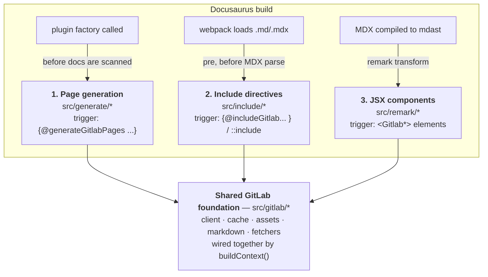
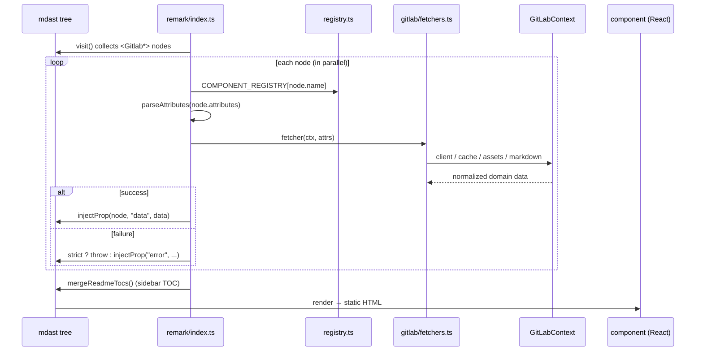
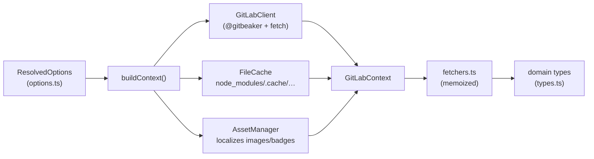
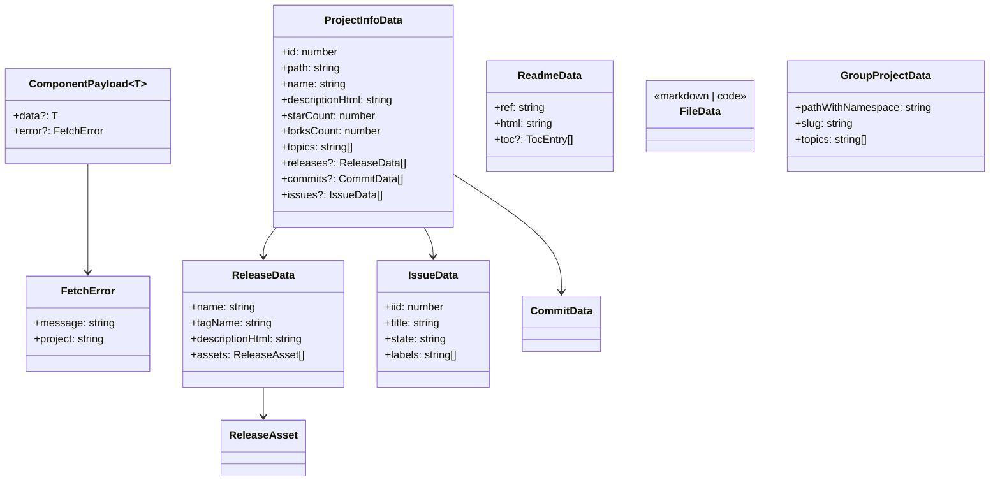

# Architecture

A developer's map of `@ebuildy/docusaurus-plugin-gitlab` — what the code is, how
it's laid out, and how data flows at build time. Read this before making a
non-trivial change; it complements the agent-facing rules in
[`../CLAUDE.md`](../CLAUDE.md) and the per-feature design specs in
[`superpowers/specs/`](superpowers/specs/).

## What the package is

A Docusaurus 3 plugin that embeds GitLab resources (project info, README,
releases, issues, files/snippets, topics, labels, project grids) into
documentation pages.

The load-bearing idea: **everything happens at build time.** GitLab is fetched
while Docusaurus compiles, and the results are baked into static HTML. The
browser never holds a token and never calls the GitLab API. That single
constraint explains most of the design — pure components, on-disk caching,
attribute values that must be static literals, and localized assets.

## The three pipelines

There is no single entry point. The plugin hooks Docusaurus at **three different
stages**, each transforming a different representation of the page, each with its
own trigger syntax. Knowing which pipeline you're in is the first question for
any change.



| # | Pipeline | Trigger in a doc | Docusaurus hook | Output |
|---|---|---|---|---|
| 1 | **Page generation** | `{@generateGitlabPages group=... }` | plugin factory (runs once per site, before the docs plugin scans the tree) | writes new `.mdx` files + `_category_.json` into `docs/` |
| 2 | **Include directives** | `{@includeGitlabReadme:...}`, `{@includeGitlabFile:...}`, `::include{file=...}` | webpack loader with `enforce: "pre"` on `.md?/.mdx?` | rewrites raw source text **before** MDX parsing |
| 3 | **JSX components** | `<GitlabReadme project="x/y" />` etc. | remark plugin over the mdast tree | injects a `data`/`error` prop consumed by pure React components |

Why three, not one? Each trigger has to be handled at the stage where its syntax
is still legal. `{@includeGitlab...}` and `{@generateGitlabPages...}` are **not
valid MDX**, so they must be substituted in raw text before the MDX parser sees
them (pipeline 2 rewrites includes into MDX; pipeline 1's directive is rewritten
by the same loader — see `src/generate/rewrite.ts`). `<Gitlab*>` elements *are*
valid MDX, so they survive to the mdast tree and are best handled there
(pipeline 3). Page generation has to run before Docusaurus scans the filesystem
so the generated pages feed the autogenerated sidebar.

## Directory map

```text
src/
├── index.ts            Public API surface (default plugin + named exports + types)
├── options.ts          PluginOptions/ResolvedOptions, Joi schema, resolveOptions() defaults
│
├── plugin/             Pipeline 1 entry — the Docusaurus plugin factory
│   └── index.ts          hooks: getClientModules, extendCli, configureWebpack; runs generateOnce()
│
├── generate/           Pipeline 1 — group → generated pages
│   ├── directive.ts      parse {@generateGitlabPages ...} attributes
│   ├── rewrite.ts        strip/replace the directive in raw source (run inside the loader)
│   ├── scan.ts           find directives across the docs tree
│   ├── render-page.ts    build the .mdx body for one project
│   ├── write.ts          write pages + _category_.json to disk
│   └── index.ts          generateAll(): scan → fetchGroupProjects → writeProjectPages
│
├── include/            Pipeline 2 — {@includeGitlab...} / ::include
│   ├── loader.ts         webpack loader entry (rewrite directive, then transformIncludes)
│   ├── grammar.ts        parse an include placeholder into a spec (project/ref/path/lineRange)
│   ├── transform.ts      resolve every placeholder, render, run out-processors, splice back
│   ├── expand.ts         recursively expand ::include{file=...} inside fetched markdown
│   ├── render-source.ts  raw source → MDX (markdown render or code fence)
│   ├── out-processors.ts built-in fixes (autolinks, void tags, styles, alerts, TOC) + user hooks
│   ├── context.ts        per-loader cached GitLabContext
│   └── logger.ts         optional @docusaurus/logger debug traces
│
├── remark/             Pipeline 3 — <Gitlab*> JSX components
│   ├── index.ts          the remark transformer: visit tree → fetch → inject prop
│   ├── registry.ts       COMPONENT_REGISTRY: component name → fetcher
│   ├── attributes.ts     parse JSX attributes (rejects dynamic expressions)
│   ├── inject.ts         inject a `data`/`error` prop onto a JSX node
│   ├── toc-export.ts     collect README TOCs for a merged sidebar
│   └── toc-merge.ts      merge those TOC entries into the tree
│
├── gitlab/             Shared foundation used by ALL three pipelines
│   ├── context.ts        buildContext(): wires client + cache + assets into a GitLabContext
│   ├── client.ts         GitLabClient — @gitbeaker/rest wrapper + requestBinary (native fetch)
│   ├── cache.ts          FileCache — on-disk JSON cache with TTL
│   ├── assets.ts         AssetManager — download + localize README images/badges
│   ├── markdown.ts       renderMarkdown / defaultMarkdownRenderChain (rehype-raw → sanitize)
│   ├── fetchers.ts       one fetcher per resource; normalize snake_case → domain types; memoized
│   ├── types.ts          domain types (ProjectInfoData, ReleaseData, ...)
│   ├── code.ts           code-fence rendering helpers (line ranges, language)
│   ├── toc.ts            TocEntry extraction from rendered README HTML
│   └── alerts.ts         GitLab/GitHub alert blockquote → admonition conversion
│
└── components/         Pure presentational React components (pipeline 3 output)
    ├── Gitlab*.tsx       one component per resource — error → Fallback; no data → null; else render
    ├── Fallback.tsx      shared error/empty state
    ├── format*.ts        formatDate / formatBytes / number formatting helpers
    ├── layout.ts         ProjectInfo section layout helper
    ├── scopedLabel.ts    GitLab scoped-label (key::value) parsing
    └── index.ts          barrel export of all components
```

## Pipeline 3 in detail (the most common one)

Adding or touching a `<Gitlab*>` component means working this loop:



`strict` (default: true in production, false in dev) decides whether a failed
fetch aborts the build or degrades to a `Fallback`. This same strict/degrade
switch appears in all three pipelines.

## Shared foundation: `buildContext()`

Every pipeline calls `buildContext(options)` to assemble the one object the
fetchers need. This is the seam where configuration turns into live clients.



Fetchers are the **only** place GitLab's snake_case REST shape
(`tag_name`, `web_url`, `star_count`, …) is allowed. They normalize it into the
camelCase domain types in `src/gitlab/types.ts` and memoize via the cache, so the
same resource fetched by two components on one page hits GitLab once.

## Domain type schema

What the fetchers emit and the components consume. Every component receives a
`ComponentPayload<T>` — exactly one of `data` or `error` is set.



`FileData` is a discriminated union: `{ kind: "markdown", html, ... }` or
`{ kind: "code", code, language, ... }`. The full, authoritative definitions live
in [`../src/gitlab/types.ts`](../src/gitlab/types.ts) — treat that file as the
source of truth; this diagram is a summary.

## Cross-cutting invariants

These hold across all pipelines. Breaking one is how the build silently regresses.

- **Security / XSS.** Anything rendered via `dangerouslySetInnerHTML`
  (README/file markdown, release notes, descriptions) MUST come from
  `renderMarkdown` in `src/gitlab/markdown.ts`, which runs `rehype-raw` **before**
  `rehype-sanitize`. Never feed raw API text to `dangerouslySetInnerHTML`. A
  user-supplied `markdownRenderChain` that omits `rehype-sanitize` emits a loud
  build warning (`warnIfChainMissingSanitize`). Regression test:
  `src/gitlab/markdown.test.ts`.
- **Static literal attributes.** `<Gitlab*>` attribute values must be static
  literals (`project="x/y"`, `limit={5}`, `lines="10-25"`); dynamic expressions
  are rejected in `attributes.ts` so data can be fetched deterministically at
  build time.
- **strict vs. degrade.** Each pipeline honors `strict`: throw and abort the
  build, or degrade (Fallback / warning comment / skipped page). Default is true
  in production, false in dev.
- **ESM-only, `.js` import extensions.** Intra-package imports carry explicit
  `.js` extensions. The package ships ESM only — a CJS build would `require()`
  the pure-ESM unified/remark deps and break. Guarded by
  `test/packaging.test.ts`. See CLAUDE.md for the full rationale.
- **Pure components.** Components in `src/components/` receive `data`/`error` and
  render — no fetching, no hooks, no side effects.

## Where to go next

- **Add a component** → the step-by-step checklist in
  [`../CLAUDE.md`](../CLAUDE.md) ("Adding a new GitLab component").
- **Why a feature is shaped a certain way** → the design spec + implementation
  plan for it in [`superpowers/specs/`](superpowers/specs/) and
  [`superpowers/plans/`](superpowers/plans/).
- **The living dependency graph** → `graphify-out/` (`graphify query "..."`).
- **Tests** are colocated (`*.test.ts(x)` next to each module); the e2e build is
  `test/e2e/build.test.ts` (slow, run explicitly).
```
